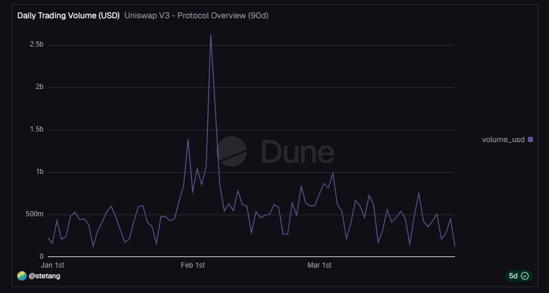
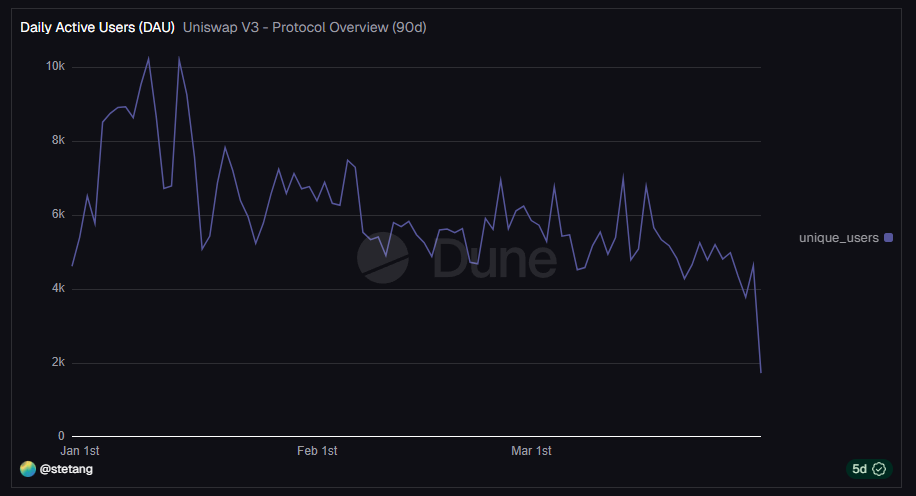

# Investigating Unusual Trading Activity on Uniswap V3

## Overview

This project analyzes irregular trading activity observed on Uniswap V3.  
The objective is to determine whether the behavior reflects organic market demand or is driven by a concentrated group of participants.

---

## Case Description

A significant increase in daily trading volume was observed in early February, exceeding the surrounding baseline and followed by rapid normalization.

More broadly, the volume pattern is characterized by short-lived surges rather than sustained growth, suggesting episodic activity rather than continuous market expansion.

---

## Evidence

### Volume



A significant increase in trading volume is observed in early February, followed by a rapid return to baseline levels.

The pattern is not consistent with steady growth and instead reflects short-term surges in activity, indicating irregular and episodic trading behavior.

---

### User Activity



Active users did not show a comparable increase during the same period.  
User activity remained relatively stable, without a spike similar to trading volume.

---

### Interpretation

The divergence between trading volume and user activity suggests that the increase in volume was not driven by broader user participation.

Instead, the activity appears to be concentrated among a limited number of participants, indicating non-organic behavior and potential coordinated trading or market-making activity.

---

## Research Questions

- Was the increase in volume accompanied by a proportional increase in users?
- How is trading activity distributed across different user segments?
- Does the data indicate organic growth or concentrated activity?

---

## Data

The analysis is based on on-chain data from Uniswap V3, accessed via Dune Analytics.

Metrics used:
- Daily trading volume (USD)
- Daily active users
- User segmentation by activity level

---

## Analysis

### Volume Dynamics

Trading volume shows short-term surges followed by rapid normalization.  
This behavior indicates temporary disruptions rather than structural growth.

---

### User Activity

The number of active users did not increase proportionally with trading volume.  
User activity remained relatively stable during periods of elevated volume.

This suggests that the increase in volume was not driven by broader market participation.

---

### Distribution of Activity

User segmentation reveals that the majority of trading volume is generated by high-frequency participants.

Heavy users (20+ transactions) account for the overwhelming share of total volume, while casual users contribute minimally.

This indicates a strong concentration of activity.

---

## Findings

- Volume increases are not supported by user growth  
- Trading activity is highly concentrated among a small subset of participants  
- Observed behavior is inconsistent with organic market expansion  

---

## Interpretation

The analysis indicates that the observed trading patterns are driven by a limited number of high-volume participants, rather than broad market demand.

Such patterns are consistent with coordinated trading behavior, market-making strategies, or concentrated positioning.

---

## Conclusion

The observed trading patterns on Uniswap V3 reflect episodic, non-organic activity rather than sustained market growth.

Understanding such behavior is important for evaluating true market demand, identifying structural risks, and interpreting on-chain signals accurately.

---

## Limitations and Next Steps

This analysis is based on aggregated on-chain metrics and does not directly identify individual wallet behavior.

Further investigation could include:
- analyzing top wallets contributing to volume during peak periods  
- examining trade size distribution  
- identifying repeated trading patterns across specific addresses  

These steps would provide deeper insight into whether the observed activity is driven by coordinated actors or independent large participants.

---

## Data Source and Methodology

The analysis is based on publicly available dashboards and on-chain data from Dune Analytics.

Dune provides structured blockchain data, allowing queries on decentralized exchange activity, including trades, volumes, and user behavior.

Visualizations are used for exploratory analysis, while conclusions are based on independent interpretation of the data.

---

## Example Query

Below is an example SQL query that can be used to aggregate daily trading volume from on-chain data:

```sql
SELECT
    DATE_TRUNC('day', block_time) AS date,
    SUM(amount_usd) AS daily_volume_usd
FROM dex.trades
WHERE block_time >= NOW() - INTERVAL '90 days'
GROUP BY 1
ORDER BY 1;
